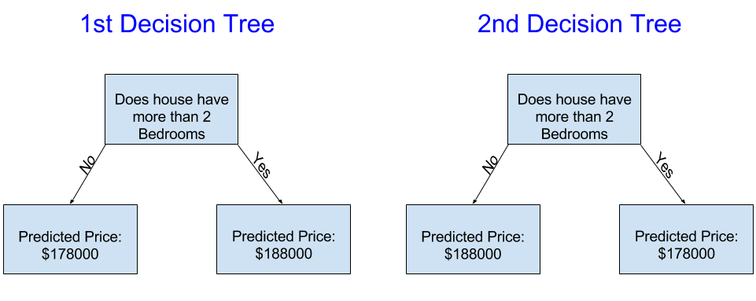

# Machine_learning_Master

Introduction

We'll start with an overview of how machine learning models work and how they are used. This may feel basic if you've done statistical modeling or machine learning before. Don't worry, we will progress to building powerful models soon.

This course will have you build models as you go through following scenario:

Your cousin has made millions of dollars speculating on real estate. He's offered to become business partners with you because of your interest in data science. He'll supply the money, and you'll supply models that predict how much various houses are worth.

You ask your cousin how he's predicted real estate values in the past, and he says it is just intuition. But more questioning reveals that he's identified price patterns from houses he has seen in the past, and he uses those patterns to make predictions for new houses he is considering.

Machine learning works the same way. We'll start with a model called the Decision Tree. There are fancier models that give more accurate predictions. But decision trees are easy to understand, and they are the basic building block for some of the best models in data science.

For simplicity, we'll start with the simplest possible decision tree

image.png

It divides houses into only two categories. The predicted price for any house under consideration is the historical average price of houses in the same category.

We use data to decide how to break the houses into two groups, and then again to determine the predicted price in each group. This step of capturing patterns from data is called fitting or training the model. The data used to fit the model is called the training data

The details of how the model is fit (e.g. how to split up the data) is complex enough that we will save it for later. After the model has been fit, you can apply it to new data to predict prices of additional homes

The decision tree on the left (Decision Tree 1) probably makes more sense, because it captures the reality that houses with more bedrooms tend to sell at higher prices than houses with fewer bedrooms. The biggest shortcoming of this model is that it doesn't capture most factors affecting home price, like number of bathrooms, lot size, location, etc.

You can capture more factors using a tree that has more "splits." These are called "deeper" trees. A decision tree that also considers the total size of each house's lot might look like this:

You predict the price of any house by tracing through the decision tree, always picking the path corresponding to that house's characteristics. The predicted price for the house is at the bottom of the tree. The point at the bottom where we make a prediction is called a leaf.

The splits and values at the leaves will be determined by the data, so it's time for you to check out the data you will be working with.

<!-- Using  pandas to  get familar with your data -->

The first step in any machine learning project is familiarize yourself with the data. You'll use the Pandas library for this. Pandas is the primary tool data scientists use for exploring and manipulating data. Most people abbreviate pandas in their code as pd. We do this with the command

<!-- Interpreting data Description  -->
The results show 8 numbers for each column in your original dataset. The first number, the count, shows how many rows have non-missing values

Missing values arise for many reasons. For example, the size of the 2nd bedroom wouldn't be collected when surveying a 1 bedroom house. We'll come back to the topic of missing data.

The second value is the mean, which is the average. Under that, std is the standard deviation, which measures how numerically spread out the values are

To interpret the min, 25%, 50%, 75% and max values, imagine sorting each column from lowest to highest value. The first (smallest) value is the min. If you go a quarter way through the list, you'll find a number that is bigger than 25% of the values and smaller than 75% of the values. That is the 25% value (pronounced "25th percentile"). The 50th and 75th percentiles are defined analogously, and the max is the largest number.

The most important part of the Pandas library is the DataFrame. A DataFrame holds the type of data you might think of as a table. This is similar to a sheet in Excel, or a table in a SQL database.

Pandas has powerful methods for most things you'll want to do with this type of data.

As an example, we'll look at data about home prices in Melbourne, Australia. In the hands-on exercises, you will apply the same processes to a new dataset, which has home prices in Iowa.

The example (Melbourne) data is at the file path ../input/melbourne-housing-snapshot/melb_data.csv.